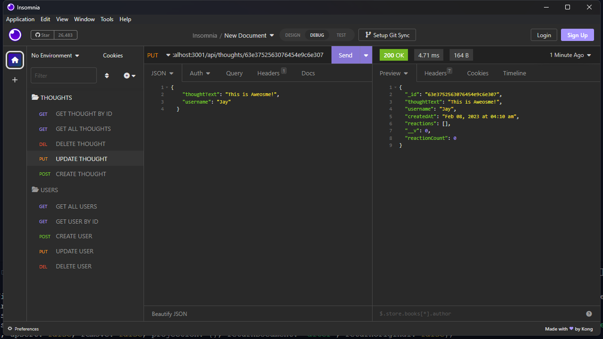

  # Social-Network-API
  [
      
  ## [Description](table-of-conents)
   MongoDB is a NoSQL database program that can handle large amounts of data quickly. 
    
  This application is an API for a Social Network that was developed using Express and Mongoose(an ODM library for MongoDB).
 
  
  ## Table of Contents 
  
  * [Installation](#installation)
  * [Usage](#usage)
  * [Credits](#credits)
  * [License](#license)
  * [Contribute](#contribute)
  
  
  ## [Installation](#table-of-contents)

  1. clone this repo 
  2. enter `npm install` in the command line 
  3. enter `npm start` in the command line
  
  ## [Usage](#table-of-contents)
1. invoke the application using the command line
2. Use [insomnia](https://insomnia.rest/) or [Postman](https://www.postman.com/) to test CRUD functionality

[Click here to walk through video demonstrating the CRUD functionality](https://raw.githubusercontent.com/Jay-MM/social-network-api/main/assets/social-network-api-walkthrough-video.mp4)
  
  
  ## [Credits](#table-of-contents)
  
  This application uses the following technologies:
  - express 
  - mongoose 
  - mongoDBCompass 
  - moment.js
  - insomnia 
  
  ## [License](#table-of-contents)
  
   
    This project is licensed by isc.
    [isc](https://choosealicense.com/licenses/isc)
  
      
  
  ## [Contribute](#table-of-contents)
  
  please follow The [Contributor Covenant](https://www.contributor-covenant.org/) if you would like to contribute
  

  ## [Questions](#table-of-contents)
  
  
Contact me through [e-mail](mailto:marquez.jay444@gmail.com)

Connect with me through [GitHub.](https://www.github.com/Jay-MM)
  